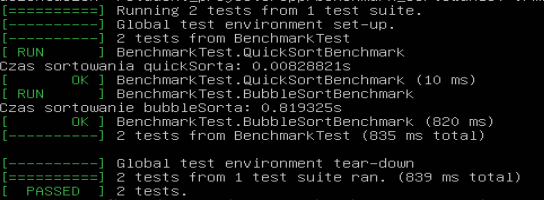

# Porównanie sortowanie bąbelkowego i QuickSorta
Ćwiczenie polegało na porównaniu czasu wykonania algorytmu sortowania bąbelkowego i QuickSort na 10000 (10 tysiącach) losowych liczbach.
## Czasy wykonania
<table>
  <tr>
    <th>Nazwa algorytmu</th>
    <th>Czas sortowania</th>
  </tr>
  <tr>
    <td>QuickSort</td>
    <td>0.00828821 sekund</td>
  </tr>
  <tr>
    <td>BubbleSort (sortowanie bąbelkowe)</td>
    <td>0.819325 sekund</td>
  </tr>
</table>

## Co zostało użyte?
Algorytmy sortowania bąbelkowego oraz QuickSorta zostały napisane w języku C++ przy użyciu dostępnych gotowych kodów znalezionych w internecie, natomiast testy przeprowadzone zostały przy użyciu biblioteki gtest.
## Zrzut ekranu
Zrzut ekranu prezentujący wykonane testy 

## Wnioski
Analizując wyniki czasu wykonania obu algorytmów wynika, że algorytm QuickSort jest około 100 razy szybszy od algorytmu sortowania bąbelkowego.
