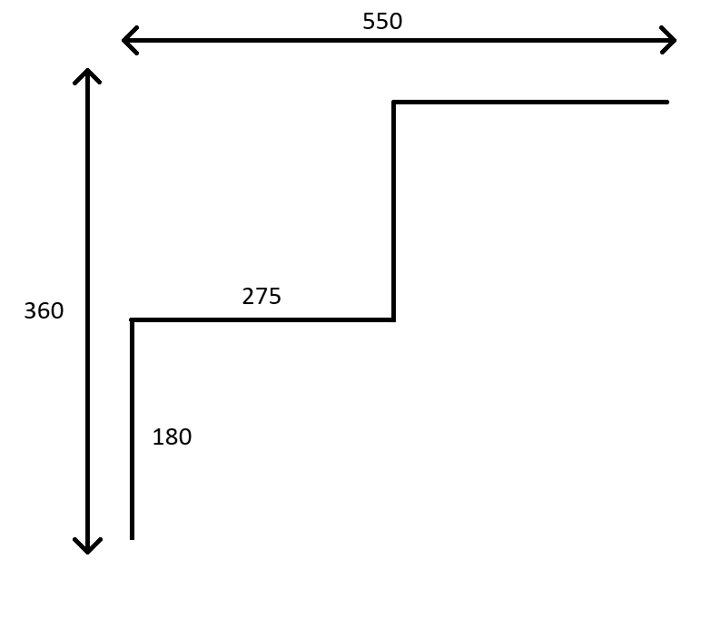

# Schody

Program oblicza ilość, długość i głębokość schodów w klatce schodowej, której wymiary są podane przez użytkownika.

# Standardy wielkości schodów

Według standardów, ergonomiczne schody powinny mieć następujące wymiary:

Wysokość schodów: **16-18 cm** <br>
Głębokość schodów: **25-32 cm**

# Działanie programu

1. Użytkownik podaje długość i wysokość w milimetrach miejsca, w którym chce zmieścić schody
2. Program sprawdza, czy schody się zmieszczą dzieląc dostępną wysokość przez kolejne liczby z zakresu [160;180]
3. Gdy program znajdzie najmniejszy dzielnik wysokości dostępnej przestrzeni ustawia liczbę schodów na zaokrągloną w górę wartość dzielenia długości dostępnej przestrzeni przez dzielnik z podanego wyżej zakresu
4. Jeżeli program nie znajdzie dzielnika wysokości dla jakiejkolwiek liczby z zakresu, zwraca wiadomość, że nie można stworzyć ergonomicznych schodów dla tej wysokości
5. Program dzieli dostępną długość na liczbę schodów, uzyskując długość jednego schodu
6. Jeżeli długość jednego schoda nie będzie mieścić się w zakresie 250-320 mm, od długości odejmuje 1 i powtarza powyższy algorytm
7. Jeżeli długość spadnie poniżej 250 mm, program zwraca wiadomość, że nie można stworzyć ergonomicznych schodów dla tej długości
8. Program zwraca ilość, długość, wysokość schodów i końcową łączną długość schodów

# Implementacja algorytmu w C++

```cpp
#include <iostream>
#include <cmath>

using namespace std;

int minHeight = 160;
int maxHeight = 180;
int minLength = 250;
int maxLength = 320;

class StairResults {

	int levels;
	int ls;
	int hs;
	int lk;
	int error;

	public:
		StairResults(int levels, int ls, int hs, int lk) {
			this -> levels = levels;
			this -> ls = ls;
			this -> hs = hs;
			this -> lk = lk;
		}

		StairResults(int error) {
			this -> error = error;
		}

		void printResults() {
			if(this -> error == 1) {
				cout<<"Nie da się stworzyć ergonomicznych schodów dla tej wysokości";
				return;
			}
			if(this -> error == 2) {
				cout<<"Nie da się stworzyć ergonomicznych schodów dla tej długości";
				return;			
			}
			cout<<"Wyniki: "<<endl;
			cout<<"Ilość stopni: "<<this -> levels<<endl;
			cout<<"Wysokość stopnia: "<<this -> hs<<endl;
			cout<<"Głębokość stopnia: "<<this -> ls<<endl;
			cout<<"Długość schodów: "<<this -> lk<<endl;
		}

		bool hasError() {
			return this -> error > 0;
		}

		int getLevels() {
			return this -> levels;
		}

		int getStairHeight() {
			return this -> hs;		
		}

		int getStairLength() {
			return this -> ls;		
		}

		int getTotalStairsLength() {
			return this -> lk;
		}

};

StairResults* getStairResults(int lk, int hk) {
	if(lk < minHeight) {
		return new StairResults(1);
	}
	int height;
	int n;
	bool initialized = false;
	for(int i = minHeight; i <= maxHeight; i++) {
		if(hk % i == 0) {
			height = i;
			n = round(hk / i);
			initialized = true;
			break;
		}
	}
	if(!initialized) {
		return new StairResults(1);
	}
	int length = round(lk / n);
	if(n * length != lk) {
		return getStairResults(lk - 1, hk);	
	}
	if(length < minLength || length > maxLength) {
		return new StairResults(2);	
	}
	return new StairResults(n, length, height, lk);
}
```

# Przykładowe wartości

<table>
	<tr>
		<th>Wysokość klatki schodowej</th>
		<th>Długość klatki schodowej</th>
		<th>Ilość schodów</th>		
		<th>Wysokość stopnia</th>
		<th>Głębokość stopnia</th>
		<th>Końcowa długość schodów</th>
	</tr>
	<tr>
		<td>360</td>
		<td>550</td>
		<td>2</td>
		<td>180</td>
		<td>275</td>
		<td>550</td>
	</tr>
	<tr>
		<td>1600</td>
		<td>2513</td>
		<td>10</td>
		<td>160</td>
		<td>251</td>
		<td>2510</td>
	</tr>
	<tr>
		<td>18180</td>
		<td>27000</td>
		<td>101</td>
		<td>180</td>
		<td>267</td>
		<td>26967</td>
	</tr>
</table>



# Testy

W pliku main_test.cpp załączono testy automatyczne napisane z użyciem biblioteki gtest dla podanych w tabeli przykładowych wartości wartości

# Scanariusz użytkowania


