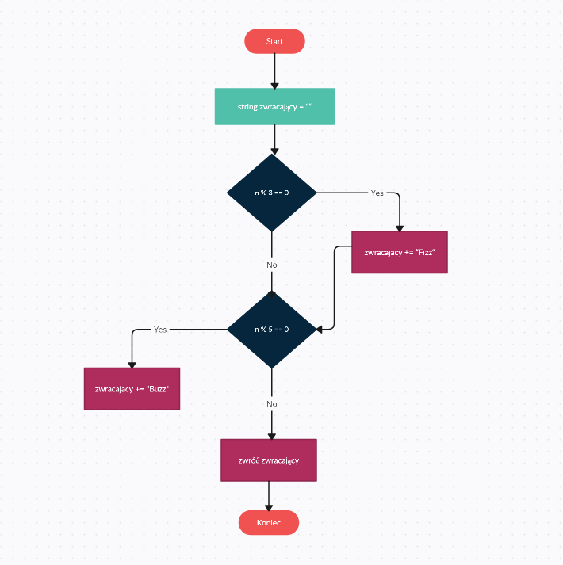

# FizzBuzz

Ćwiczenie polega na tym, żeby funkcja zwróciła "Fizz", jeżeli podana liczba jest podzielna przez 3 oraz "Buzz" - jeżeli jest podzielna przez 5.
Zostały napisane testy, które sprawdzają czy napisana funkcja działa poprawnie.
## Dostępne testy
- Czy zostało zwrócone "Buzz" dla liczby 9 (jest podzielna przez 3)
- Czy zostało zwrócone "Fizz" dla liczby 10 (jest podzielna prez 5)
- Czy zostało zwrócone "FizzBuzz" dla liczby 15 (jest podzielna zarówno przez 3 jak i 5)
- Czy nic nie zostało zwrócone dla liczby 8 (liczba nie jest podzielna przez 3 ani 5)
## Co zostało użyte?
Testy, jak i sama funkcja FizzBuzz została napisana w języku C++, z użyciem biblioteki gtest.
## Wnioski
Warto pisać testy jednostkowe dla funkcji aby sprawdzić, czy działa ona poprawnie. Można wtedy wyeliminować ewentualne błędy.
## Schemat blokowy funkcji

